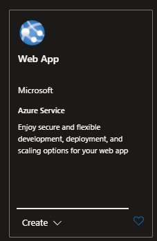
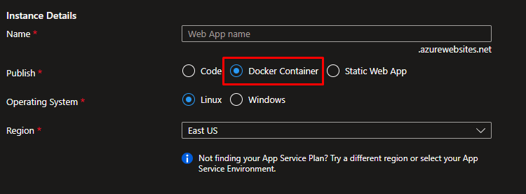
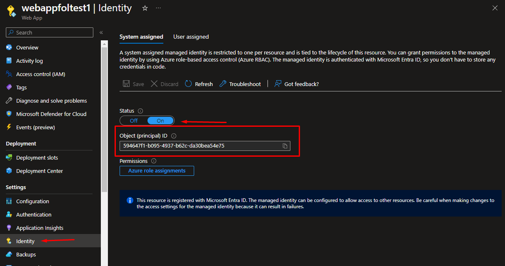
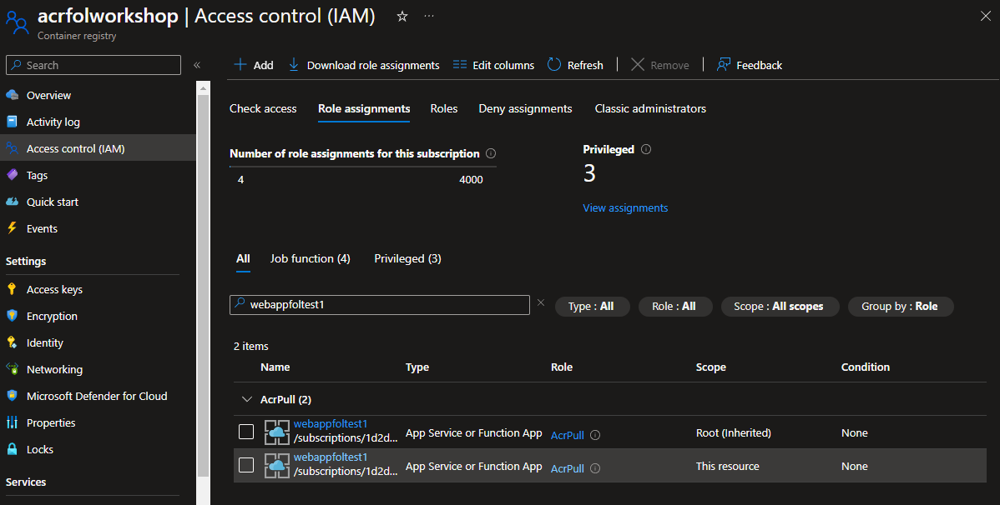
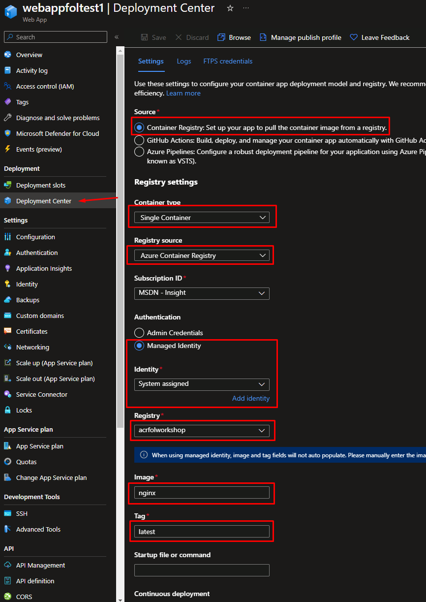

# 4. Despliegue de una imagen desde Azure Container Registry (ACR) a Azure App Service:

1. Nos dirigimos al portal de Azure y creamos un AppService
   
   

Importante no olvidar selecconar que la forma de publicación será "Docker Container"

2. Dentro del App Service nos dirigimos a a opción de Identity y activamos la System Assigned Managed Identity (puede hacerse con User Assigned Managed Identity)

3. Dar permisos a la Web App en ACR: en la seccion RBAC del ACR le asignamos permisos a la identidad de la web app, el role que hay que asignar es el de "AcrPull"  para permitir que nuestra WebApp descargue las imagenes.

4. En la web app, en el apartado "Deployment Center" realizamos la configuración para que nuestra WebApp sepa que imagen descargar:

Source: indicaremos que vamos a desplegar mediante Container Registry
Container Type: Single Container. De esta forma le decimos que nuestra aplicacion solo correrá un contenedor
Registry Source: indicamos que nuestra imagen está alojada en un ACR
Authentication: Decimos que nos autenticaremos con managed identity
Registry: el ACR donde tenemos la imagen
Image: el nombre de la imagen
Tag: el tag que le hemos colocado a la imagen

5. Guardamos la configuración y enseguida tendremos nuestra imagen desplegada en la WebApp.
