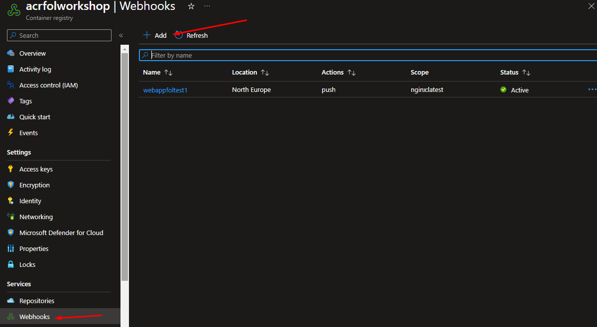

# 5. Despliegue continuo

¿Que ocurre si actualizamos nuestra imagen con la configuración actual? Nada, el appservice solo descarga las imagenes al iniciar, tendriamos que reiniciar el appservice para que actualice la imagen.

Para permitir un despliegue continuo con cada vez que actualizamos la imagen deberemos configurar el Continuous Deployment en la WebApp

1. En la WebApp activamos Continuous Deployment y copiamos "Webhook URL"

2. En el ACR, dentro de la opción webhook añadimos uno nuevo

3. Subimos la nueva version de la imagen y comprobamos si se actualiza.