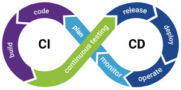

# 1. Introducción a CI/CD

La integración continua (CI) y la entrega continua (CD) son prácticas fundamentales en el desarrollo de software moderno.

- Integración Continua (CI): Es el proceso de integrar y probar cambios de código de forma automática y continua en un repositorio compartido. Cada vez que se realiza un cambio en el repositorio, se ejecutan pruebas automatizadas para garantizar que el código nuevo no rompa la aplicación existente.

- Entrega Continua (CD): Es la práctica de automatizar el proceso de implementación de software para que las nuevas versiones de la aplicación se puedan implementar en cualquier momento con un mínimo esfuerzo manual.

Nota: Laboratorio [GitOps con ArgoCD](https://github.com/telekito/gitops-hol)