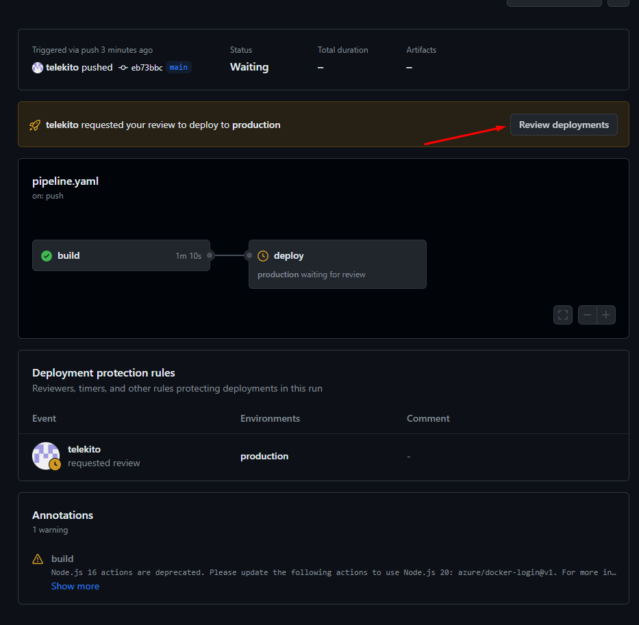

# 3. Pipeline

1. Creamos un nuevo repositorio en github.com y lo clonamos a nuestro ordenador
2. Copiamos el codigo de ejemplo en la carpeta del repositorio [react-nginx](../Modulo2_acr_deploy/ejercicio/react-nginx/)
3. Creamos nuestro archivo de pipeline en la ruta .github\workflows\ y le damos el nombre que queramos. Ej: pipeline.yaml
4. Copiamos el siguiente contenido al archivo de pipeline

```yaml
name: Build Docker Image CI

on:
  push:
    branches: [ "main" ]
  pull_request:
    branches: [ "main" ]

jobs:
  build:
    runs-on: ubuntu-latest
    steps:
    - uses: actions/checkout@v4
    - name: 'Docker Login'
      uses: azure/docker-login@v1
      with:
        login-server: ${{ vars.ACRName }}.azurecr.io
        username: ${{ secrets.ACR_USERNAME }}
        password: ${{ secrets.ACR_PASSWORD }}
    - name: Build the image and push it to ACR
      uses: docker/build-push-action@v5
      with:
        push: true
        tags: ${{ vars.ACRName }}.azurecr.io/${{ vars.AppName }}:${{ github.run_number }}
        file: ./Dockerfile    

  deploy:
    runs-on: ubuntu-latest
    needs: build
    environment:
      name: 'production'      
    steps:    
    - name: Deploy to Azure Web App
      id: deploy-to-webapp
      uses: azure/webapps-deploy@v2
      with:
        app-name: 'appwsdocker3'
        slot-name: 'production'
        publish-profile: ${{ secrets.AzureAppService_PublishProfile }}
        images: '${{ vars.ACRName }}.azurecr.io/${{ vars.AppName }}:${{ github.run_number }}'
```

5. Vamos a github.com al proyecto y configuramos los secretos y variables necesarios: settings > Secrets and variables > actions:
- Repository secrets:
  - ACR_PASSWORD
  - ACR_USERNAME
  - AZUREAPPSERVICE_PUBLISHPROFILE
- Repository variables
  - ACRNAME
  - APPNAME

ACR_PASSWORD y ACR_USERNAME los obtenemos en nuestro ACR > Access key > activamos Admin user


AZUREAPPSERVICE_PUBLISHPROFILE lo obtenemos descargando el perfil de publicacion de nuestro appservice:


6. Subimos el codigo a la rama main y el pipeline comenzará el despliegue. Una vez desplegado podremos navegar hasta nuestra aplicacion

Protección del entorno de producción: para solicitar aprobación para desplegar en el entorno de producción tendremos que realizar la siguiente configuración: settings > Environments > production > Required reviewers


Si volvemos a desplegar, observaremos que el pipeline no finaliza hasta que los usuarios autorizados validen el cambio.



